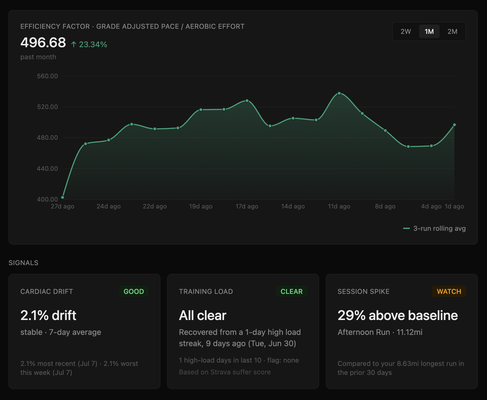

# Stryde

Running analytics platform that computes personalized training signals from Strava running data: efficiency factor, cardiac drift, training load, and session spike.

**Live app:** https://stryde-iota.vercel.app



---

## Features

| Signal | What it measures |
|---|---|
| **Efficiency Factor** | Grade-adjusted pace normalized to heart-rate reserve |
| **Cardiac Drift** | First-half vs. second-half efficiency within a single run (aerobic decoupling) |
| **Training Load** | Cumulative training stress via TRIMP (heart-rate-based formula) |
| **Session Spike** | Longest run this week vs. your own trailing 30-day baseline |

Thresholds for each signal are computed from each user's own historical distribution, not a fixed population average.

All signals are also available per-run, in a training log listing every run from the last 60 days alongside its distance, pace, heart rate, and a direct link to the corresponding run on Strava.

---

## Tech stack

- **Frontend:** React, TypeScript, Vite, Tailwind CSS, deployed on Vercel
- **Backend:** Node.js, Express, TypeScript, deployed on Railway
- **Database:** PostgreSQL (Supabase)
- **Auth:** Strava OAuth2, JWT
- **Sync:** Strava webhooks (activity create/update/delete, deauthorization)

---

## Architecture

**Data pipeline:** A user connects their Strava account via OAuth2. On initial connection and on every subsequent sync, activity metadata is pulled from Strava's API. For each activity, raw per-second heart rate, velocity, and altitude streams are fetched separately (`server/src/utils/sync.ts`) and passed through each signal's computation. The resulting values are stored, so the dashboard reads precomputed results rather than recalculating them on every load.

**Sync:** New activities, updates, and deletions are pushed from Strava via a webhook subscription (`server/src/routes/webhooks.ts`) and processed automatically. A manual sync action is available as a fallback.

**Signals:** Each signal is implemented as its own module under `server/src/signals/`, computed independently and read directly by the frontend.

---

## Setup

```bash
# Backend
cd server
npm install
npm run dev

# Frontend
cd client
npm install
npm run dev
```

Requires a Strava API application, a Supabase project, and, for webhook testing, a public callback URL.

---

## Status

An AI-powered synthesis feature (Claude API, `server/src/routes/synthesis.ts`) is implemented but incomplete and is not enabled in production, pending review of Strava's API Developer Agreement. Gated behind `ENABLE_AI_SYNTHESIS` / `VITE_ENABLE_AI_SYNTHESIS`.

Automated tests, containerization, and CI/CD are not yet implemented.

---

## Signal methodology

**Efficiency Factor** is grade-adjusted pace normalized to heart-rate reserve. Grade adjustment uses Minetti's (2002) energy-cost-of-running model to account for elevation change, and heart-rate reserve is calculated with the Karvonen method, using each user's own resting and max heart rate.

**Cardiac Drift** (aerobic decoupling) compares efficiency in the first half of a run against the second half. A rising heart rate relative to pace over the course of a run indicates cardiovascular fatigue that pace alone would not show.

**Training Load** is computed with TRIMP (Training Impulse), a heart-rate-based measure of training stress originally developed by Banister. It combines session duration with heart-rate-reserve intensity, weighted so that higher-intensity effort contributes disproportionately more to the total than an equivalent duration at low intensity.

**Session Spike** compares an individual's longest run in the last 7 days against their own trailing 30-day baseline, based on methodology from [Frandsen et al. (2025), *British Journal of Sports Medicine*](https://pmc.ncbi.nlm.nih.gov/articles/PMC12421110/), on single-session training load and injury risk.
